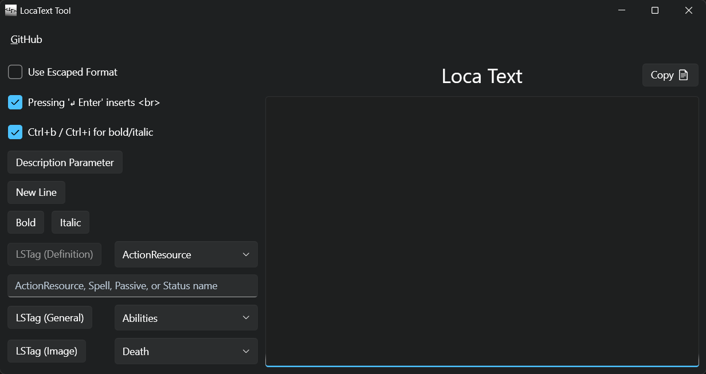

# bg3-loca-text
### Helper for creating Tooltip Text for Baldur's Gate 3 mods

---
## Running the exe
- Requires [.NET 9](https://dotnet.microsoft.com/en-us/download/dotnet/9.0) or newer
- No other dependencies or install needed, just run `bg3-loca-text.exe`

---
## Features and Usage

### Options
- Use Escaped Format
	- When disabled it leaves `<`, `>`, and `&` as literals.  The Toolkit uses this style for input.
	- When enabled it will use `&lt;`, `&gt;`, and `&amp;` to represent the characters above.
- Pressing '↵ Enter' inserts ` `
	- This enables a shortcut to quickly add line breaks
- Ctrl+b / Ctrl+i for bold/italic
	- Another keyboard shortcut to quickly add bold or italic sections

### Controls
- Description Parameter
	- This inserts a value placeholder for description parameters
	- I don't bother trying to count them, so you need to update the index
- New Line
	- Adds a ` ` to insert a new line
- Bold / Italic
	- Adds bold or italic tags
- LSTag (Definition)
	- Adds a LSTag set for ActionResource, Spell, Passive, or Status type
	- Requires the name of resource/definition, ie `BLESS` or `Target_Bless`, etc.
- LSTag (General)
	-  Adds a LSTag set for general types of info.  See [LSTag Types] for full list
- LSTag (Image)
	- Adds a LSTag set for images like the level up symbol.  See [LSTag Types] for full list
- Copy 📄
	- Quick copy contents of text

### Hints
- For controls that add "wrapper" tags, it will try to surround selected text
	- Example: Given the phrase: "Use italics to provide emphasis"
	- If you select the word italics, then click on the Italic button 
      (or press Ctrl+i if enabled), it will surround the word
	- Result: "Use \<i>italics\</i> to provide emphasis"
- You can use the "Use Escaped Format" option to convert between the two formats
	- Example: Set "Use Escaped Format" to checked, paste: "\&lt;i\&gt;Example\&lt;/i\&gt;"
	- Uncheck the option for "Use Escaped Format" to convert it
	- Result: "\<i>Example\</i>"

### LSTag Types

General LSTag Types

- Abilities
- AbilityCheck
- AbilityModifier
- Acrobatics
- Action
- Advantage
- AlwaysPrepared
- AnimalHandling
- Arcana
- ArmourClass
- ArmourProficiency
- Athletics
- AttackRoll
- BackgroundGoals
- CampSupplies
- Cantrip
- CarryWeight
- Charisma
- CharmedGroup
- Concentration
- Constitution
- CriticalHit
- Deception
- Dexterity
- DifficultyClass
- Dippable
- Disadvantage
- Downed
- Encumbered
- EvocationSpells
- Expertise
- Finesse
- HighGroundRules
- History
- HitPoints
- Immune
- IncapacitatingCondition
- Insight
- Inspiration
- Intelligence
- Intimidation
- Investigation
- Light
- LongRest
- Medicine
- MeleeSpellAttack
- MeleeWeaponAttack
- MonkWeapon
- MovementSpeed
- MusicalInstrumentProficiency
- Nature
- OpportunityAttack
- Perception
- Performance
- Persuasion
- PortentDie
- PreparedSpells
- Proficiency
- ProficiencyBonus
- RangedSpellAttack
- RangedWeaponAttack
- Reach
- Religion
- Resistant
- RitualSpell
- SavingThrow
- ShortRest
- Skill
- SkillCheck
- SleightOfHand
- SpellDifficultyClass
- SpellSlot
- SpellcastingAbility
- SpellcastingAbilityModifier
- Stealth
- Strength
- Survival
- TemporaryHitPoints
- Thrown
- TwoHanded
- Versatile
- Vulnerable
- WarlockSpellSlot
- WeaponProficiency
- WildMagic
- Wisdom

Image LSTag Types

- Death
- DismissShapeshift
- DownedHelp
- Ellipsis
- Inspiration
- Prone
- Reroll
- SoftWarning
- SpellSlotPAD
- SpellSlot
- TidesOfChaos
- TutorialActionFilter
- TutorialAdvantage
- TutorialAlchemyMenu
- TutorialBonusActionFilter
- TutorialCallForthAllies
- TutorialCallForthAllies_c
- TutorialCampMenu
- TutorialCamp
- TutorialCharacterSheet
- TutorialCombatLog
- TutorialConsumableTadpole
- TutorialCureWounds
- TutorialDisengage
- TutorialDismissWildShape
- TutorialDualWieldToggle
- TutorialEncumbered
- TutorialEndTurn
- TutorialFlee
- TutorialGroupSneak
- TutorialHealingPotion
- TutorialHelpAction
- TutorialHide
- TutorialIllithidMenu
- TutorialIllithidPowersMenu
- TutorialIllithidPowers
- TutorialInventory
- TutorialJournal
- TutorialJump
- TutorialLearnSpell
- TutorialLevelUpMenu
- TutorialLevelUp
- TutorialLightSpell
- TutorialLongRestMenu
- TutorialLongRest
- TutorialMap
- TutorialMeleeToggle
- TutorialMonkUnarmedAttack
- TutorialNonLethalToggle
- TutorialPartyInventory
- TutorialPing
- TutorialRangedToggle
- TutorialRedWarning
- TutorialRevivifyScroll
- TutorialShortRestMenu
- TutorialShortRest
- TutorialShove
- TutorialSneakAttackMelee
- TutorialSneakAttackRanged
- TutorialSpellbook
- TutorialStealthDimLight
- TutorialStealthFullLight
- TutorialStealthShadow
- TutorialThievesTools
- TutorialTorch
- TutorialTrapDisarmKit
- WarlockSpellSlotPAD
- WarlockSpellSlot

---
## Future Features
- [ ] Fix annoying text re-sizing when changing focus
- [ ] Downloading updates
- [ ] Support Undo/Redo operations

---
## Troubleshooting/Known Issues
...

---
## Contributing
PRs are welcome for improvements or additional features
